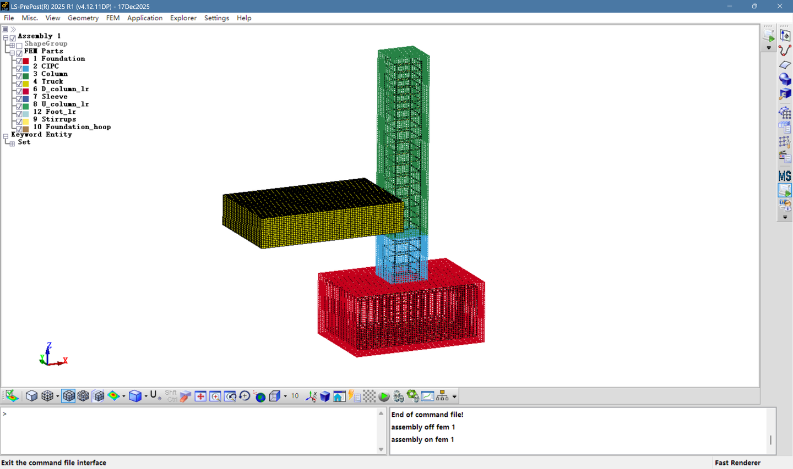

# LSPP-Parametric-Modeling

用 **LS-PrePost（LSPP）脚本**做参数化建模：一套「**SCL 脚本建几何 + cfile 命令行配关键字**」的联合方案，在预制混凝土（PC）柱水平冲击模型上跑通。

提到有限元参数化建模，通常想到的是 ABAQUS 的 `.py`、ANSYS 的 APDL、SAP2000 的 OAPI。LS-PrePost 是后处理起家的软件，表面上没有参数化的入口——但它自带 SCL 脚本示例，而所有 GUI 操作又都会同步落进命令行窗口。把这两条线接起来，改网格尺寸、截面尺寸、箍筋间距就不必再点一遍界面了。

## 背景

课题需要从 ABAQUS 转到 LS-DYNA。没有用 APDL，从头到现在一直是 LS-PrePost 建模，于是试着在 LSPP 上做参数化。翻安装目录时发现官网附带的 SCL 示例脚本，发现里面可以声明变量、可以循环、可以直接调用建模命令，参数化的口子就在这里。但 SCL 里一导入 `*MAT` 这类关键字 LSPP 就会卡死，所以材料、截面、接触还是得回到命令行脚本（cfile）里做。最后成型的就是两者联合的写法。

## 三条路线

| 路线 | 来源 | 能否定义参数 | 说明 |
| --- | --- | --- | --- |
| SCL 脚本 | LSPP 安装目录里的 `SCL_Examples` | **能**：变量、循环、`sprintf` 拼命令 | 用 `ExecuteCommand()` 把命令串发下去；适合建几何、建集合 |
| cfile 命令行 | GUI 操作自动记录到 `lspost.cfile` / `lspost.msg` | 不能（可外挂 `*PARAMETER`） | 与 ABAQUS 的 `.jnl` 类似，是 GUI 的操作日志；把 k 文件里的关键字拷过来改一改即可 |
| **SCL + cfile 联合** | 上面两条拼起来 | 能 | 本项目使用的方式：SCL 负责 Part 与 Part_List / Node_Set，cfile 负责 MAT / SECTION / CONTACT / CONSTRAINED / CONTROL / DATABASE |

关于 cfile 的局限：`.jnl` 可以转成 `.py` 再来做参数化，而 cfile 到目前为止还没有找到定义参数的办法，所以单独用 cfile 建模仍是死板的。

## 仓库结构

```
.
├─ scl/
│  ├─ PC_column.scl           # 主脚本：PC 柱模型几何（参数在文件开头）
│  └─ example_25shell.scl     # 官方示例改写：建 25 个壳单元的平板并读取数据库
├─ cfile/
│  └─ PC_column.cfile         # 材料 / 截面 / 接触 / 约束 / 控制 / 输出
└─ docs/images/               # 运行过程截图
```

## 快速开始

**1. 建几何**

LS-PrePost → `Misc.` → `Run SCL` → 选择 `scl/PC_column.scl` → `Run`。

要改尺寸就改文件开头的赋值语句，除此之外不用动：

```c
h = 250;        /* 柱截面高 */
b = 250;        /* 柱截面宽 */
l = 1500;       /* 柱长（含后浇带） */
meshsize = 12.5;/* 实体网格尺寸 */
c = 37.5;       /* 纵筋中心到混凝土边缘的距离 */
choopspace = 75;/* 柱箍筋间距 */
```

**2. 配关键字**

把 `cfile/PC_column.cfile` 放到任意目录，LS-PrePost → `File` → `Open` → `Command File` → 选择该文件 → `Start`。

> 注意：LSPP 每次保存模型都会把当前会话的命令覆盖写进同目录的 `lspost.cfile`，所以自己写的脚本务必另存成别的文件名。

**3. 手动补边界条件**（见下文「已知问题」第 3 条），保存 k 文件，逐项检查后再提交计算。

## 建模要点

**实体 Part**——`meshing boxsolid create` 的 6 个坐标是包围盒的上下限，后 3 个数是三个方向的网格数；`accept` 的 3 个整数依次是 Part ID、起始单元 ID、起始节点 ID：

```c
sprintf(p, "meshing boxsolid create %d %d %d %d %d 0 %f %f %f 0",
    -basea/2, -baseb/2, -basel, basea/2, baseb/2,
    basea/meshsize, baseb/meshsize, basel/meshsize);
ExecuteCommand(p);
strcpy(p, "meshing boxsolid accept 1 1 1 Foundation");
ExecuteCommand(p);
```

只有第一个 Part 的 ID 是 1，后续 Part 的起始 ID 要从数据库里现取再加一：

```c
numnodes = SCLGetDataCenterInt("num_nodes");
numelem  = SCLGetDataCenterInt("num_elem");
numelem  = numelem + 1;
numnodes = numnodes + 1;
```

**梁单元 Part**——先用 `line param` 建线，再选中这些线生成梁：

```c
sprintf(p,"line param %d %d %d %d %d %d",
    (h/2-c),(b/2-c), c2,-(h/2-c),(b/2-c), c2);
ExecuteCommand(p);
...
ExecuteCommand("genselect geomobject add geomobject 1e 2 3 4");
sprintf(p,"elgenerate beam bycurve 6 %d 0 1 %f", numelem, meshsize);
ExecuteCommand(p);
ExecuteCommand("elgenerate accept");
```

**箍筋阵列**——模型沿高度分了几个区段，箍筋间距不同，所以用了 5 段代码。复制靠 `occtransform translate`，方向由前 3 个数给定：

```c
sprintf(p,"occtransform translate 0 0 -1 %d copy %d %de %d %d %d",
    choopspace, 14,(numedges+1),(numedges+2),(numedges+3),(numedges+4));
```

**分组**——后面 cfile 要按组指定接触和约束，所以在 SCL 里就把 Part 与节点集建好：

```c
ExecuteCommand("setpart");                    /* 切换到 Part 集合模式 */
ExecuteCommand("genselect target part");
ExecuteCommand("genselect clear");
ExecuteCommand("genselect part add part 1/0");
ExecuteCommand("setpart createset 1 1 0 0 0 0");   /* 集合 1 = 基础+后浇带+柱 */
```

## 参数

### 构件与网格（SCL）

| 变量 | 取值 | 含义 |
| --- | --- | --- |
| `h` / `b` / `l` | 250 / 250 / 1500 | 柱截面高度、宽度、柱长（mm） |
| `basea` / `baseb` / `basel` | 900 / 600 / 400 | 基础长、宽、高（mm） |
| `linkl` / `linkrl` | 300 / 100 | 后浇带长度、套筒长度（mm） |
| `meshsize` | 12.5 | 实体网格尺寸（mm） |
| `c` | 37.5 | 纵筋中心到混凝土边缘的距离（mm） |
| `c2` | 50 | 常用构造距离（mm） |
| `choopspace` | 75 | 柱箍筋加密区间距（mm） |
| `bhoopaspace` / `bhoopbspace` | 50 / 50 | 基础箍筋两个方向的间距（mm） |
| `numbhoopa` / `numbhoopb` | 11 / 17 | 基础箍筋两个方向的根数 |

### 落锤小车（SCL，仅建几何）

| 变量 | 取值 | 含义 |
| --- | --- | --- |
| `carl` / `carw` / `carh` | 1000 / 600 / 200 | 小车长、宽、高（mm） |
| `dashH` | 500 | 小车中心的离地高度（mm） |
| `dis` | 2 | 小车与柱面的初始间隙（mm） |
| `v` | 2 | 初速度（SCL 中声明；实际速度写在 cfile 的 `*INITIAL_VELOCITY_GENERATION` 里） |

### Part 编号与名称

| Part ID | 名称 | 类型 |
| --- | --- | --- |
| 1 | Foundation | 实体（基础混凝土） |
| 2 | CIPC | 实体（后浇带混凝土） |
| 3 | Column | 实体（柱混凝土） |
| 4 | Truck | 实体（小车） |
| 6 | D\_column\_lr | 梁（下部纵筋） |
| 7 | Sleeve | 梁（套筒段钢筋） |
| 8 | U\_column\_lr | 梁（上部纵筋） |
| 9 | Stirrups | 梁（柱箍筋） |
| 10 | Foundation\_hoop | 梁（基础箍筋） |
| 12 | Foot\_lr | 梁（基础纵筋） |

5 与 11 号是中间过程里被 `elgenerate` 消费掉的线几何，不出现在最终的 Part 列表里。

### 关键字（cfile）

- 材料：`*MAT_CSCM_CONCRETE`（柱 / 后浇带两套，`fpc` 分别 35.4 / 47.4 MPa）、`*MAT_PLASTIC_KINEMATIC`（纵筋 / 套筒 / 钢板）、`*MAT_ELASTIC`（小车刚性体）
- 沙漏：`*HOURGLASS`（IHQ=4，QM=0.03）与 `*CONTROL_HOURGLASS`
- 截面：`*SECTION_SOLID`（实体）、`*SECTION_BEAM`（10 / 16 / 32 mm 三种钢筋）
- 关联：`partdata assignapply` 一次性指定 Part–Section–MAT
- 接触：`*CONTACT_AUTOMATIC_SURFACE_TO_SURFACE`（柱–小车）、`*CONTACT_AUTOMATIC_SURFACE_TO_SURFACE_TIEBREAK`（基础–后浇带、柱–后浇带）
- 约束：`*CONSTRAINED_BEAM_IN_SOLID`（纵筋 / 箍筋嵌入混凝土）
- 加载与求解：`*LOAD_SEGMENT_SET` 轴压、`*INITIAL_VELOCITY_GENERATION` 冲击速度、`*CONTROL_DYNAMIC_RELAXATION` 动力松弛
- 输出：`*DATABASE_BINARY_D3PLOT` / `D3THDT` / `D3DUMP` / `D3DRLF` 与 `GLSTAT` / `MATSUM` / `RCFORC` / `NCFORC` / `NODOUT`

## 已知问题与限制

1. **线的 ID 只能手工计数。** 目前还没找到从数据库索引里取 line ID 的办法，所以要靠 `numedges = numedges + 4*15` 这样的累加去推算后面几条线的编号。改任何一段箍筋的高度或间距，都必须重算它后面的计数——这是这套脚本里最脆弱的地方。
2. **材料关键字不能进 SCL。** 在 SCL 里导入 `*MAT` 之类的关键字会让 LSPP 直接卡死，所以几何与关键字必须拆成两个文件跑。
3. **边界条件不能进 cfile。** 用 cfile 创建边界条件同样会卡死，`PC_column.cfile` 里的 BOUNDARY 段已注释掉，需要运行后在界面里手动添加。
4. `meshing boxsolid accept` 的第 2~4 个 Part，原稿用 `strcpy` 拼接 `&numelem`、`&numnodes`，这两个 ID 写不进命令串。本仓库按代码注释的意图改成了 `sprintf("%d %d")`，并在原处保留了说明注释。
5. `KEYWORD INPUT` 的编号存在重复（`1 / 2 / 3` 与 `40` 各出现两次），是从关键字输入面板分几次拼装留下的痕迹。本仓库保留原编号未作重排——重排后的文件尚未在软件里验证过。
6. 代码里基本没有健壮性处理：不校验返回值、没有错误分支。**直接拿来用可能出意外，运行最终 k 文件前请逐项检查。**

## 结果

运行 SCL 后再跑 cfile，得到的是下面这个模型（截图取自 LS-PrePost）：



`Assembly 1` 下依次是 Foundation、CIPC、Column、Truck 四个实体 Part，以及 D\_column\_lr、Sleeve、U\_column\_lr、Stirrups、Foundation\_hoop、Foot\_lr 六个钢筋 Part。

其余截图见 `docs/images/`：`01-run-scl.png` 是 SCL 脚本的运行入口，`02-shape-mesher.png` 是 GUI 操作与命令行同步的样子，`03-cfile-run.png` 是 cfile 的运行入口。

## 环境

- LS-PrePost(R) 2025 R1 (v4.12.11DP) 64bit Windows
- 单位制：mm / ms / t（密度以 t/mm³ 给出，如混凝土 2.4e-9）

## 说明

个人学习与研究过程中整理的脚本，未经作者许可请勿转载。
